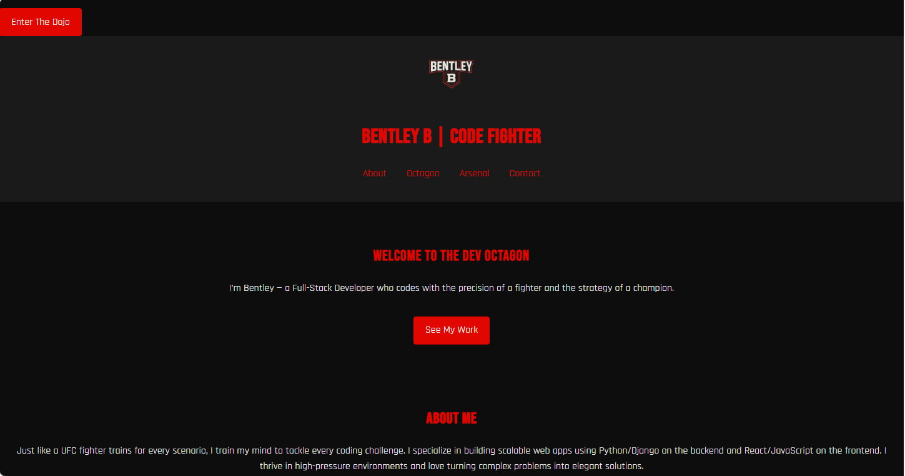
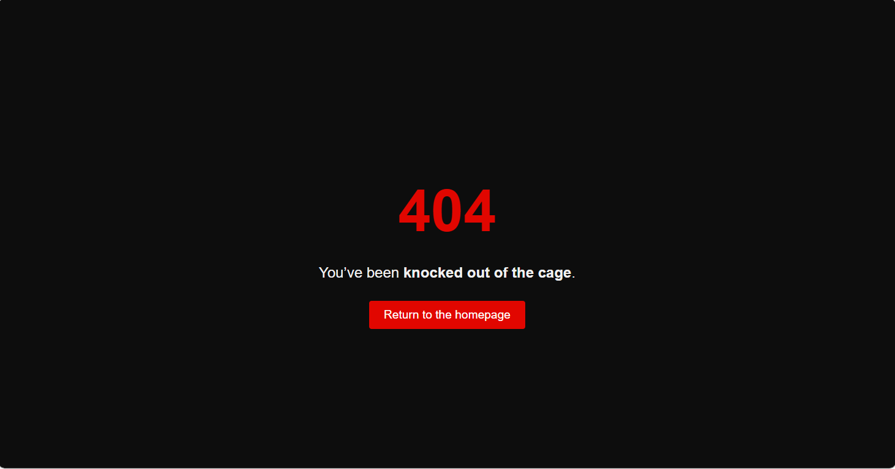

# 🥋 UFC Portfolio – Bentley

Welcome to my personal developer portfolio — inspired by the energy, discipline, and design of the UFC. This site showcases my full-stack projects, skills, and journey from zero to code warrior.

## 🔗 Live Site

👉 [Visit the Portfolio](https://lgg6bentley.github.io/ufc-portfolio/)

## 🧰 Tech Stack

- **HTML5 / CSS3 / JavaScript**
- **GitHub Pages** for deployment
- **Custom 404 Page** with fighter-themed design
- Optional integrations: Formspree (contact), animations, and more

## 💡 Features

- Responsive layout with bold, dark UFC-inspired styling
- Interactive project cards and clean navigation
- Custom 404 page:  
  > “You’ve been knocked out of the cage. Return to the homepage.”
- Built from scratch — no templates, just code and grit

## 📸 Screenshots

| Home Page | 404 Page |
|-----------|----------|
|  | |

## 📬 Contact

Want to collaborate or just talk code?

📧 **lgg6bentley@gmail.com**

---

> “Started from zero. Now I’m building like I’ve been here.”  
> — Bentley, future code warrior 🥋
